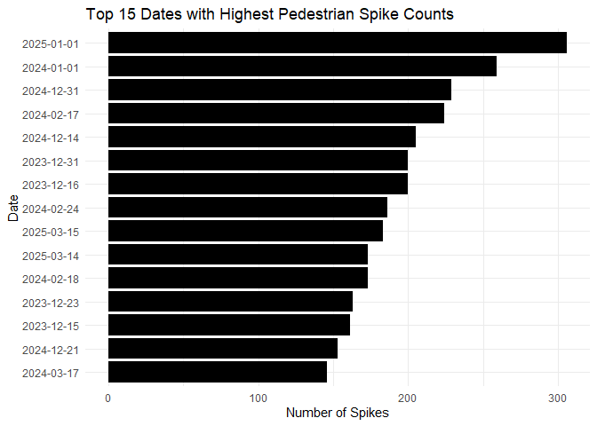

## Introduction

In a recent global survey, Melbourne Australia ranked **sixteenth** in the most walkable cities worldwide [@walksurvey], demonstrating how deeply walking is ingrained in the city's culture. This report investigates the complexities within Melbourne pedestrian trends between August 2023 and August 2025, analysing seasonal variation, disruptions and changes over time and location-based travel patterns to assist in highlighting urban planning opportunities.

Utilising a subset of the [City of Melbourne Pedestrian Counting System (counts per hour)](https://data.melbourne.vic.gov.au/explore/dataset/pedestrian-counting-system-monthly-counts-per-hour/export/) data [@peddata], the past 2-years of hourly walking traffic detected by Melbourne sensors from August 2023 to August 2025 will be explored. Each observation contains the following variables:


Table: (\#tab:variables)Pedestrian Dataset Variables

|Variable     |Type           |Description                                          |
|:------------|:--------------|:----------------------------------------------------|
|Location_ID  |numeric        |ID number for sensor location                        |
|Sensing_Date |POSIXct/POSIXt |Date of observation                                  |
|HourDay      |numeric        |Hour of the day in which observation was recorded    |
|Total_Peds   |numeric        |Total number of pedestrians observed within the hour |
|Sensor_Name  |character      |Name of sensor location                              |
|Location     |character      |Latitude and Longitude of sensor location            |
Within the subset of the Pedestrian Counting System data, there are **1048575 observations** across **6 variables**, as described in Table \@ref(tab:variables) above, with recordings dated from 8 August 2023 to 7 August 2025.

## Analysis - Megan O'Rorke

With **21%** of all trips in Melbourne being walked [@walkmatters], this makes walking the second most popular mode of transportation after driving.

Utilising the subset of [@peddata], this section of analysis will explore the below research questions to highlight prevalent trends within Melbourne pedestrian traffic from August 2023 to August 2025.

- **Does pedestrian traffic in Melbourne experience annual seasonality?**
- **How has Melbourne pedestrian traffic changed over time?** 
- **Which are the busiest locations in Melbourne for pedestrian traffic?**

### Seasonality

Does Melbourne's often unpredictable seasonal weather impact on pedestrian traffic trends? The dataset is reformatted, grouping each pedestrian observation into its associated year and season to analyse seasonality.


``` r
# Convert Sensing_Date column to date format for analysis (Sanderson 2024)
ped_data_megan1 <- ped_data_megan %>%
  mutate(Sensing_Date = date(Sensing_Date)) %>%
# Create Month and Year columns derived from the Sensing_Date values
  mutate(Month = month(Sensing_Date, label=TRUE), 
         Year = year(Sensing_Date)) %>%
# Create a season column by grouping each month into Summer, Autumn, Winter or Spring
  mutate(Season = ifelse(Month %in% c("Jan", "Feb", "Dec"), "Summer", 
                  ifelse(Month %in% c("Mar", "Apr", "May"), "Autumn", 
                  ifelse(Month %in% c("Jun", "Jul", "Aug"), "Winter", 
                  ifelse(Month %in% c("Sep", "Oct", "Nov"), "Spring", NA)))))
```


Table: (\#tab:seasonal-totals)Total Melbourne Pedestrians Per Season (all sensor locations), 2023-2025

| Year|Season | Total_Peds|
|----:|:------|----------:|
| 2023|Summer |   18596616|
| 2023|Winter |   11968713|
| 2023|Spring |   48354826|
| 2024|Summer |   52095408|
| 2024|Autumn |   52081447|
| 2024|Winter |   47773987|
| 2024|Spring |   51217305|
| 2025|Summer |   32829151|
| 2025|Autumn |   56158393|
| 2025|Winter |   34122221|
In Table \@ref(tab:seasonal-totals) above, the total number of pedestrians each season is depicted. An annual trend can be observed, whereby Melbourne pedestrian traffic reduces significantly in winter each year. Overall, Autumn of 2025 recorded the highest traffic, with **56,158,393** total pedestrians.

Autumn and spring return similar annual pedestrian levels to summer, however spring of 2023 significantly exceeded the summer pedestrian traffic in the same year. This may be attributed to the extremity of heat in summer discouraging pedestrians, or that many Melbournians vacation over that period, disrupting regular work and school commuting patterns.

*(Note: Summer of 2025 data is incomplete with only January included and winter of 2023 is incomplete with only August included in this dataset. Autumn of 2023 omitted from analysis.)*

The bar chart below depicts the seasonal trends in pedestrian traffic over time, from 2023 to 2025.


``` r
# Use ggplot to create basic plot
# Plot year on x axis, value on y axis, and ensure the fill of bars is set to each measure
stacked_bar_chart <- seasonal_totals %>%
  group_by(Year, Season) %>%
  ggplot(aes(x=Year, y=Total_Peds, fill = Season)) +
  # Set bar position to fill for the proportion of pedestrians each season
  geom_bar(stat = "identity", position = "fill") +
  labs(x = "Year", 
       y = "Proportion of Total Pedestrians",
       fill = "Season") +
  # Set theme
  theme_light()
# Use ggplotly from plotly package to make plot interactive
ggplotly(stacked_bar_chart)
```

<div class="figure" style="text-align: center">

```{=html}
<div class="plotly html-widget html-fill-item" id="htmlwidget-4df43db4d5f972942f5e" style="width:100%;height:480px;"></div>
<script type="application/json" data-for="htmlwidget-4df43db4d5f972942f5e">{"x":{"data":[{"orientation":"v","width":[0.90000000000009095,0.90000000000009095,0.90000000000009095],"base":[0.76436163867138884,0.74358476577531618,0.73333430536562227],"x":[2023,2024,2025],"y":[0.23563836132861116,0.25641523422468382,0.26666569463437773],"text":["Year: 2023<br />Total_Peds: 0.2356384<br />Season: Summer","Year: 2024<br />Total_Peds: 0.2564152<br />Season: Summer","Year: 2025<br />Total_Peds: 0.2666657<br />Season: Summer"],"type":"bar","textposition":"none","marker":{"autocolorscale":false,"color":"rgba(248,118,109,1)","line":{"width":1.8897637795275593,"color":"transparent"}},"name":"Summer","legendgroup":"Summer","showlegend":true,"xaxis":"x","yaxis":"y","hoverinfo":"text","frame":null},{"orientation":"v","width":[0.90000000000009095,0.90000000000009095],"base":[0.48723824803107546,0.27716908565295367],"x":[2024,2025],"y":[0.25634651774424072,0.4561652197126686],"text":["Year: 2024<br />Total_Peds: 0.2563465<br />Season: Autumn","Year: 2025<br />Total_Peds: 0.4561652<br />Season: Autumn"],"type":"bar","textposition":"none","marker":{"autocolorscale":false,"color":"rgba(124,174,0,1)","line":{"width":1.8897637795275593,"color":"transparent"}},"name":"Autumn","legendgroup":"Autumn","showlegend":true,"xaxis":"x","yaxis":"y","hoverinfo":"text","frame":null},{"orientation":"v","width":[0.90000000000009095,0.90000000000009095,0.90000000000009095],"base":[0.61270566435152085,0.2520931836819873,0],"x":[2023,2024,2025],"y":[0.15165597431986799,0.23514506434908816,0.27716908565295367],"text":["Year: 2023<br />Total_Peds: 0.1516560<br />Season: Winter","Year: 2024<br />Total_Peds: 0.2351451<br />Season: Winter","Year: 2025<br />Total_Peds: 0.2771691<br />Season: Winter"],"type":"bar","textposition":"none","marker":{"autocolorscale":false,"color":"rgba(0,191,196,1)","line":{"width":1.8897637795275593,"color":"transparent"}},"name":"Winter","legendgroup":"Winter","showlegend":true,"xaxis":"x","yaxis":"y","hoverinfo":"text","frame":null},{"orientation":"v","width":[0.90000000000009095,0.90000000000009095],"base":[0,0],"x":[2023,2024],"y":[0.61270566435152085,0.2520931836819873],"text":["Year: 2023<br />Total_Peds: 0.6127057<br />Season: Spring","Year: 2024<br />Total_Peds: 0.2520932<br />Season: Spring"],"type":"bar","textposition":"none","marker":{"autocolorscale":false,"color":"rgba(199,124,255,1)","line":{"width":1.8897637795275593,"color":"transparent"}},"name":"Spring","legendgroup":"Spring","showlegend":true,"xaxis":"x","yaxis":"y","hoverinfo":"text","frame":null}],"layout":{"margin":{"t":26.228310502283104,"r":7.3059360730593621,"b":40.182648401826491,"l":48.949771689497723},"plot_bgcolor":"rgba(255,255,255,1)","paper_bgcolor":"rgba(255,255,255,1)","font":{"color":"rgba(0,0,0,1)","family":"","size":14.611872146118724},"xaxis":{"domain":[0,1],"automargin":true,"type":"linear","autorange":false,"range":[2022.405,2025.595],"tickmode":"array","ticktext":["2023","2024","2025"],"tickvals":[2023,2024,2025],"categoryorder":"array","categoryarray":["2023","2024","2025"],"nticks":null,"ticks":"outside","tickcolor":"rgba(179,179,179,1)","ticklen":3.6529680365296811,"tickwidth":0.33208800332088001,"showticklabels":true,"tickfont":{"color":"rgba(77,77,77,1)","family":"","size":11.68949771689498},"tickangle":-0,"showline":false,"linecolor":null,"linewidth":0,"showgrid":true,"gridcolor":"rgba(222,222,222,1)","gridwidth":0.33208800332088001,"zeroline":false,"anchor":"y","title":{"text":"Year","font":{"color":"rgba(0,0,0,1)","family":"","size":14.611872146118724}},"hoverformat":".2f"},"yaxis":{"domain":[0,1],"automargin":true,"type":"linear","autorange":false,"range":[-0.050000000000000003,1.05],"tickmode":"array","ticktext":["0.00","0.25","0.50","0.75","1.00"],"tickvals":[0,0.25,0.5,0.75,1],"categoryorder":"array","categoryarray":["0.00","0.25","0.50","0.75","1.00"],"nticks":null,"ticks":"outside","tickcolor":"rgba(179,179,179,1)","ticklen":3.6529680365296811,"tickwidth":0.33208800332088001,"showticklabels":true,"tickfont":{"color":"rgba(77,77,77,1)","family":"","size":11.68949771689498},"tickangle":-0,"showline":false,"linecolor":null,"linewidth":0,"showgrid":true,"gridcolor":"rgba(222,222,222,1)","gridwidth":0.33208800332088001,"zeroline":false,"anchor":"x","title":{"text":"Proportion of Total Pedestrians","font":{"color":"rgba(0,0,0,1)","family":"","size":14.611872146118724}},"hoverformat":".2f"},"shapes":[{"type":"rect","fillcolor":"transparent","line":{"color":"rgba(179,179,179,1)","width":0.66417600664176002,"linetype":"solid"},"yref":"paper","xref":"paper","layer":"below","x0":0,"x1":1,"y0":0,"y1":1}],"showlegend":true,"legend":{"bgcolor":"rgba(255,255,255,1)","bordercolor":"transparent","borderwidth":1.8897637795275593,"font":{"color":"rgba(0,0,0,1)","family":"","size":11.68949771689498},"title":{"text":"Season","font":{"color":"rgba(0,0,0,1)","family":"","size":14.611872146118724}}},"hovermode":"closest","barmode":"relative"},"config":{"doubleClick":"reset","modeBarButtonsToAdd":["hoverclosest","hovercompare"],"showSendToCloud":false},"source":"A","attrs":{"9e283162492d":{"x":{},"y":{},"fill":{},"type":"bar"}},"cur_data":"9e283162492d","visdat":{"9e283162492d":["function (y) ","x"]},"highlight":{"on":"plotly_click","persistent":false,"dynamic":false,"selectize":false,"opacityDim":0.20000000000000001,"selected":{"opacity":1},"debounce":0},"shinyEvents":["plotly_hover","plotly_click","plotly_selected","plotly_relayout","plotly_brushed","plotly_brushing","plotly_clickannotation","plotly_doubleclick","plotly_deselect","plotly_afterplot","plotly_sunburstclick"],"base_url":"https://plot.ly"},"evals":[],"jsHooks":[]}</script>
```

<p class="caption">(\#fig:stacked-bar-chart-seasonality)Seasonality of Melbourne Pedestrian Traffic, 2023-2025</p>
</div>
In Figure \@ref(fig:stacked-bar-chart-seasonality), due to incomplete data observations for 2023 and 2025 it is difficult to comment on seasonality over time.

From the complete 2024 seasonal data, it is observed that summer and autumn share the highest proportion of total pedestrians, around 25.6%, with spring following closely at 25.2%. Whilst winter trails only by 1.7%, this does suggest a slight decline in pedestrian activity over the colder months.

### Pedestrian Traffic Over Time

Has the volume of Melbourne pedestrian traffic decreased over time, particularly following the pandemic whereby 35 to 40 per cent of Australians are working remotely in 2025 [@SMH]? The dataset is reformatted, grouping each pedestrian observation into its associated year and month to analyse average traffic trends.


Table: (\#tab:monthly-average-peds)Average Monthly Melbourne Pedestrians Per Hour (all sensor locations), 2023-2025

| Year|Month | Average_Peds|
|----:|:-----|------------:|
| 2024|Mar   |       442.29|
| 2023|Dec   |       431.30|
| 2024|Feb   |       426.16|
| 2023|Sep   |       414.23|
| 2023|Aug   |       413.93|
| 2025|Mar   |       412.23|
| 2023|Nov   |       411.70|
| 2024|Apr   |       406.09|
| 2025|Apr   |       397.00|
| 2023|Oct   |       396.31|
In Table \@ref(tab:monthly-average-peds) above, the ten months with the highest average pedestrians per hour are displayed. March 2024 returned the highest mean pedestrian traffic, recording an average of **442.29** pedestrians per hour.

Of the top 10 months, 50% are in 2023, 30% are in 2024 and 20% are in 2025. This decline indicates a negative association between year and monthly average pedestrian traffic per hour, suggesting that environmental and cultural factors are impacting on pedestrian trends.

The line plot below depicts the average monthly pedestrian traffic per hour, over time from 2023 to 2025.


``` r
# Use ggplot to create line plot of the monthly average peds per hour
line_plot <- monthly_average %>% 
  # Transform Month into ordinal factor so each month is arranged in the correct order on x axis
  mutate(Month = factor(Month, levels = c("Jan", "Feb", "Mar", "Apr", "May", "Jun", "Jul", "Aug", "Sep", "Oct", "Nov", "Dec"))) %>%
  # Use ggplot to plot month on x axis, average_peds on y axis, with separate lines for and colors for each year group
  ggplot(aes(x=Month, y=Average_Peds, color=factor(Year), group=Year)) +
  geom_line() +
  geom_point() +
  # Set axis and color labels
  labs(x = "Month",
    y = "Average Pedestrians (Per Hour)",
    color = "Year") +
  # Set different theme
  theme_light()
# Use ggplotly from plotly package to make plot interactive
ggplotly(line_plot)
```

<div class="figure" style="text-align: center">

```{=html}
<div class="plotly html-widget html-fill-item" id="htmlwidget-de7faadb1e7cf0d4bbcd" style="width:100%;height:480px;"></div>
<script type="application/json" data-for="htmlwidget-de7faadb1e7cf0d4bbcd">{"x":{"data":[{"x":[8,9,10,11,12],"y":[413.92747708801659,414.22997105564963,396.31407889266586,411.69722612870373,431.29588570898466],"text":["Month: Aug<br />Average_Peds: 413.9275<br />factor(Year): 2023<br />Year: 2023","Month: Sep<br />Average_Peds: 414.2300<br />factor(Year): 2023<br />Year: 2023","Month: Oct<br />Average_Peds: 396.3141<br />factor(Year): 2023<br />Year: 2023","Month: Nov<br />Average_Peds: 411.6972<br />factor(Year): 2023<br />Year: 2023","Month: Dec<br />Average_Peds: 431.2959<br />factor(Year): 2023<br />Year: 2023"],"type":"scatter","mode":"lines+markers","line":{"width":1.8897637795275593,"color":"rgba(248,118,109,1)","dash":"solid"},"hoveron":"points","name":"2023","legendgroup":"2023","showlegend":true,"xaxis":"x","yaxis":"y","hoverinfo":"text","marker":{"autocolorscale":false,"color":"rgba(248,118,109,1)","opacity":1,"size":5.6692913385826778,"symbol":"circle","line":{"width":1.8897637795275593,"color":"rgba(248,118,109,1)"}},"frame":null},{"x":[1,2,3,4,5,6,7,8,9,10,11,12],"y":[380.06508903249801,426.16227125275486,442.28842938225665,406.08756712102439,380.04243035190615,351.74091634588302,358.4298895536125,386.04521902967497,348.34172819971872,380.85631855938112,376.69724212812162,388.38488454930228],"text":["Month: Jan<br />Average_Peds: 380.0651<br />factor(Year): 2024<br />Year: 2024","Month: Feb<br />Average_Peds: 426.1623<br />factor(Year): 2024<br />Year: 2024","Month: Mar<br />Average_Peds: 442.2884<br />factor(Year): 2024<br />Year: 2024","Month: Apr<br />Average_Peds: 406.0876<br />factor(Year): 2024<br />Year: 2024","Month: May<br />Average_Peds: 380.0424<br />factor(Year): 2024<br />Year: 2024","Month: Jun<br />Average_Peds: 351.7409<br />factor(Year): 2024<br />Year: 2024","Month: Jul<br />Average_Peds: 358.4299<br />factor(Year): 2024<br />Year: 2024","Month: Aug<br />Average_Peds: 386.0452<br />factor(Year): 2024<br />Year: 2024","Month: Sep<br />Average_Peds: 348.3417<br />factor(Year): 2024<br />Year: 2024","Month: Oct<br />Average_Peds: 380.8563<br />factor(Year): 2024<br />Year: 2024","Month: Nov<br />Average_Peds: 376.6972<br />factor(Year): 2024<br />Year: 2024","Month: Dec<br />Average_Peds: 388.3849<br />factor(Year): 2024<br />Year: 2024"],"type":"scatter","mode":"lines+markers","line":{"width":1.8897637795275593,"color":"rgba(0,186,56,1)","dash":"solid"},"hoveron":"points","name":"2024","legendgroup":"2024","showlegend":true,"xaxis":"x","yaxis":"y","hoverinfo":"text","marker":{"autocolorscale":false,"color":"rgba(0,186,56,1)","opacity":1,"size":5.6692913385826778,"symbol":"circle","line":{"width":1.8897637795275593,"color":"rgba(0,186,56,1)"}},"frame":null},{"x":[1,2,3,4,5,6,7,8],"y":[359.89682388941651,366.44459930313587,412.2310462589258,397.00432725961434,362.68107694217957,332.04779877400068,374.40665592904804,371.64427207637232],"text":["Month: Jan<br />Average_Peds: 359.8968<br />factor(Year): 2025<br />Year: 2025","Month: Feb<br />Average_Peds: 366.4446<br />factor(Year): 2025<br />Year: 2025","Month: Mar<br />Average_Peds: 412.2310<br />factor(Year): 2025<br />Year: 2025","Month: Apr<br />Average_Peds: 397.0043<br />factor(Year): 2025<br />Year: 2025","Month: May<br />Average_Peds: 362.6811<br />factor(Year): 2025<br />Year: 2025","Month: Jun<br />Average_Peds: 332.0478<br />factor(Year): 2025<br />Year: 2025","Month: Jul<br />Average_Peds: 374.4067<br />factor(Year): 2025<br />Year: 2025","Month: Aug<br />Average_Peds: 371.6443<br />factor(Year): 2025<br />Year: 2025"],"type":"scatter","mode":"lines+markers","line":{"width":1.8897637795275593,"color":"rgba(97,156,255,1)","dash":"solid"},"hoveron":"points","name":"2025","legendgroup":"2025","showlegend":true,"xaxis":"x","yaxis":"y","hoverinfo":"text","marker":{"autocolorscale":false,"color":"rgba(97,156,255,1)","opacity":1,"size":5.6692913385826778,"symbol":"circle","line":{"width":1.8897637795275593,"color":"rgba(97,156,255,1)"}},"frame":null}],"layout":{"margin":{"t":26.228310502283104,"r":7.3059360730593621,"b":40.182648401826491,"l":43.105022831050235},"plot_bgcolor":"rgba(255,255,255,1)","paper_bgcolor":"rgba(255,255,255,1)","font":{"color":"rgba(0,0,0,1)","family":"","size":14.611872146118724},"xaxis":{"domain":[0,1],"automargin":true,"type":"linear","autorange":false,"range":[0.40000000000000002,12.6],"tickmode":"array","ticktext":["Jan","Feb","Mar","Apr","May","Jun","Jul","Aug","Sep","Oct","Nov","Dec"],"tickvals":[1,2,3,4.0000000000000009,5,6,7.0000000000000009,8,9,10,11,12],"categoryorder":"array","categoryarray":["Jan","Feb","Mar","Apr","May","Jun","Jul","Aug","Sep","Oct","Nov","Dec"],"nticks":null,"ticks":"outside","tickcolor":"rgba(179,179,179,1)","ticklen":3.6529680365296811,"tickwidth":0.33208800332088001,"showticklabels":true,"tickfont":{"color":"rgba(77,77,77,1)","family":"","size":11.68949771689498},"tickangle":-0,"showline":false,"linecolor":null,"linewidth":0,"showgrid":true,"gridcolor":"rgba(222,222,222,1)","gridwidth":0.33208800332088001,"zeroline":false,"anchor":"y","title":{"text":"Month","font":{"color":"rgba(0,0,0,1)","family":"","size":14.611872146118724}},"hoverformat":".2f"},"yaxis":{"domain":[0,1],"automargin":true,"type":"linear","autorange":false,"range":[326.53576724358788,447.80046091266945],"tickmode":"array","ticktext":["330","360","390","420"],"tickvals":[330,360,390,420],"categoryorder":"array","categoryarray":["330","360","390","420"],"nticks":null,"ticks":"outside","tickcolor":"rgba(179,179,179,1)","ticklen":3.6529680365296811,"tickwidth":0.33208800332088001,"showticklabels":true,"tickfont":{"color":"rgba(77,77,77,1)","family":"","size":11.68949771689498},"tickangle":-0,"showline":false,"linecolor":null,"linewidth":0,"showgrid":true,"gridcolor":"rgba(222,222,222,1)","gridwidth":0.33208800332088001,"zeroline":false,"anchor":"x","title":{"text":"Average Pedestrians (Per Hour)","font":{"color":"rgba(0,0,0,1)","family":"","size":14.611872146118724}},"hoverformat":".2f"},"shapes":[{"type":"rect","fillcolor":"transparent","line":{"color":"rgba(179,179,179,1)","width":0.66417600664176002,"linetype":"solid"},"yref":"paper","xref":"paper","layer":"below","x0":0,"x1":1,"y0":0,"y1":1}],"showlegend":true,"legend":{"bgcolor":"rgba(255,255,255,1)","bordercolor":"transparent","borderwidth":1.8897637795275593,"font":{"color":"rgba(0,0,0,1)","family":"","size":11.68949771689498},"title":{"text":"Year","font":{"color":"rgba(0,0,0,1)","family":"","size":14.611872146118724}}},"hovermode":"closest","barmode":"relative"},"config":{"doubleClick":"reset","modeBarButtonsToAdd":["hoverclosest","hovercompare"],"showSendToCloud":false},"source":"A","attrs":{"9e28759952a5":{"x":{},"y":{},"colour":{},"type":"scatter"},"9e2834d92c21":{"x":{},"y":{},"colour":{}}},"cur_data":"9e28759952a5","visdat":{"9e28759952a5":["function (y) ","x"],"9e2834d92c21":["function (y) ","x"]},"highlight":{"on":"plotly_click","persistent":false,"dynamic":false,"selectize":false,"opacityDim":0.20000000000000001,"selected":{"opacity":1},"debounce":0},"shinyEvents":["plotly_hover","plotly_click","plotly_selected","plotly_relayout","plotly_brushed","plotly_brushing","plotly_clickannotation","plotly_doubleclick","plotly_deselect","plotly_afterplot","plotly_sunburstclick"],"base_url":"https://plot.ly"},"evals":[],"jsHooks":[]}</script>
```

<p class="caption">(\#fig:line-plot-monthly)Average Monthly Pedestrian Traffic (Per Hour), 2023-2025</p>
</div>
In Figure \@ref(fig:line-plot-monthly), the decline in monthly average pedestrian traffic per hour is evident from 2023 to 2025.

June of 2025 recorded the lowest hourly pedestrian average, at **332.05**. Compared to June of 2024 at **351.74** average pedestrians per hour, this is a significant annual discrepancy. Declines may be attributed to changes in working and commuting culture in Melbourne over time, or highlight any environmental changes such as June of 2025 experiencing more rain and wind than June of 2024. 

Overall, all months of 2024 recorded lower average hourly pedestrians than their 2023 counterparts, and similarly, all months of 2025 recorded deficits when compared to 2024, with the exception of July 2025. This supports the notion that remote working is becoming increasingly prevalent and may be a key contributor for decreased pedestrian traffic.

### Busiest Melbourne Locations

Which are the busiest sensor locations in Melbourne in 2025 for pedestrian traffic and do these popular sensors cluster around a common area? The dataset is reformatted, grouping each 2025 pedestrian observation into its associated sensor location to analyse pedestrian counts.


Table: (\#tab:busiest-locations)Total Pedestrians Per Sensor Location, 2025

|Sensor_Name | Total_Peds|
|:-----------|----------:|
|Swa31       |    5659735|
|SouthB_T    |    5106032|
|QVN_T       |    4682586|
|ElFi_T      |    4656550|
|Col620_T    |    3506364|
|Eli250_T    |    3344026|
|Swa123_T    |    3050095|
|VAC_T       |    2866414|
|Swa148_T    |    2610307|
|Bou688_T    |    2608494|
In Table \@ref(tab:busiest-locations) above, the ten sensors with the highest total pedestrian traffic in 2025 are displayed. The Swa31 sensor has the highest total traffic at **5,659,735** pedestrians in 2025, significantly greater than the tenth most popular sensor, Bou688_T at **2,608,494** pedestrians.

The popularity of locations is explored in the map plot below [@maps], depicting the total number of pedestrians per sensor location in 2025.


``` r
# Set Melbourne CBD center coordinates
melb_cbd <- c(lon = 144.9631, lat = -37.8136)

# Create bounding box coordinates (OpenAI 2024)
bbox <- c(
  left = melb_cbd["lon"] - 0.01,
  bottom = melb_cbd["lat"] - 0.01,
  right = melb_cbd["lon"] + 0.01,
  top = melb_cbd["lat"] + 0.01
)
# Ensure bbox names are correct for get_stadiamap()
names(bbox) <- c("left", "bottom", "right", "top")

# Get a Stamen terrain map centered on Melbourne CBD (OpenAI 2024)
melb_map <- get_stadiamap(
  bbox = bbox,
  zoom = 15,
  maptype = "stamen_terrain"
)

# Filter pedestrian data for 2025 only, separate coords for mapping and calc total_peds
ped_data_map <- ped_data_megan1 %>%
  filter(Year == 2025) %>%
  # Separate Location column into longitude and latitude values for mapping
  separate(Location, into = c("lat", "lon"), sep= ", ", convert=TRUE) %>%
  # Group by sensor location and sum total pedestrians
  group_by(Sensor_Name, lat, lon) %>%
  summarise(Total_Peds = sum(Total_Peds, na.rm=TRUE), .groups = "drop")

# Use ggmap to plot lon and lat sensor points
ggmap(melb_map) +
  # Use total_peds to colour the sensor points according to density, and also depict the size of the dot based on density
  geom_point(data = ped_data_map, aes(x = lon, y = lat, size = Total_Peds, color = Total_Peds)) +
  # Create axis labels and colour variation based on total pedestrians and dot size based on total pedestrians. Add citing subtitle for map data
  labs(x = "Longitude", y = "Latitude", color = "Total Pedestrian Count", size = "Total Pedestrian Count") +
  theme_light() +
  # Remove scientific notation of large pedestrian totals from the legend and set colour scheme
  scale_color_distiller(palette = "PuRd", labels = scales::label_comma()) +
  # Remove scientific notation of large pedestrian totals from the legend
  scale_size_continuous(range = c(1, 6), labels = label_comma())
```

<div class="figure" style="text-align: center">

<p class="caption">(\#fig:total-ped-map)Total Pedestrians Per Sensor Location, 2025</p>
</div>
In Figure \@ref(fig:total-ped-map) [@stadiamaps] [@openmaptiles] [@openstreetmap], it is evident that the busiest sensor location in Melbourne is the intersection of Swanston Street and Flinders Lane, recording over **5 million** total pedestrians in 2025.

Also recording over 5 million total pedestrians, is the Southbank Promenade sensor at the end of Southgate Avenue.

Generally, the sensor locations closest to transportation hubs such as Flinders Street Station and Melbourne Central Station in central Melbourne have the highest pedestrian traffic counts in 2025, with sensors on the outskirts of the city recording < 1 million pedestrians. 

## Analysis Aldwin

To further the investigative potential of the data set for practical application such as event planning, infrastructure prioritisation, and resource allocation, the below analysis will seek to answer:

- **Can pedestrian data allow us to ascertain whether or not a major event in Melbourne had occurred?**
- **Is volatility associated with pedestrian traffic? i.e. the busiest streets are due to the volatility in the traffic.** 

### Predicting demands
When Melbourne plays hosts to major events it would be expected that the pedestrian traffic would increase. By this logic the largest spikes in pedestrian traffic should also correspond with major events occurring in the city.



The figure above shows the 15 dates with the most spikes in pedestrian traffic (where spikes are when a sensor detects pedestrian traffic above 2 standard deviations). As we can see there are some stand out dates which would be expected; 31 December and 1 January which co-inside with new year’s festivities. However, the other dates require a deeper dive to identify if there were any major events during those days. 
January 1 2025 - New Years Day
January 1 2024 - New Years Day
December 31 2024 - New Years Eve
Febuary 17 2024 - Taylor Swift Eras Concert
Decemeber 14 2024 - No discernible major event/holiday
December 31 2023 - New Years Eve
Decemeber 16 2023 - No discernible major event/holiday
March 15 2025 - Formula 1 Australian Grand Prix
March 14 2025 - Formula 1 Australian Grand Prix
Febuary 24 2025 - No discernible major event/holiday
Febuary 18 2025 - No discernible major event/holiday
December 23 2023 - No discernible major event/holiday
December 15 2023 - No discernible major event/holiday
December 21 2024 - No discernible major event/holiday; summer solstice
March 9 2025 - Moomba Festival Sunday

As we can observe a majority of the spiked traffic is a result of a major event occurring in Melbourne at the time which would invite foot traffic. However, there are some dates that do not appear to have any major events. That is not to say there is no causation for these spikes in foot traffic, but these causes may not be directly from major events e.g. roadworks causing upticks in foot traffic, multiple smaller events occurring simultaneously.

### Volitiliy
Often there is talk about whether our city can contain the demand of its people. However often these demands are needed sparingly and the cost versus benefit must be considered when it comes to expansion of footpaths, walking trails etc, is this the case when it comes to our busiest streets?


As observed in the chart below we can see the locations that have the highest average pedestrian traffic also have the highest volatility in their traffic. A possible explanation for this is high traffic locations may be situated near event venues, tourist areas, or transport hubs that experience irregular surges. In contrast, the bottom 10 locations have relatively stable traffic patterns, which may indicate they are stable commuter corridors or quieter areas. Additionally, the data collection occurred at different hours during the day, thus some of the high volatility can be explained by recording that occur when there is little traffic regardless of the area e.g. late at night, which would have a greater impact on variance for typically higher traffic areas.

## Conclusion

The analysis of Melbourne pedestrian traffic from August 2023 to August 2025 highlights notable seasonal, temporal and spatial trends. 

Despite seasonal conclusions being difficult to make due to incomplete data limitations, it was evident that pedestrian activity drops significantly during winter months, while spring and autumn show consistently higher pedestrian volumes. Summer tends to experience volatility, which is likely attributed to environmental factors such as heatwaves, or cultural factors such as holiday and vacation trends typical for that season.

The monthly average pedestrian counts declined steadily over the data period, likely influenced by increasing remote work practices and evolving commuting patterns following the pandemic. 

Spatial mapping of sensor data revealed that central Melbourne locations, such as the intersection of Swanston Street and Flinders Lane and Southbank Promenade, are major pedestrian hubs attracting the highest foot traffic. These insights contribute to understanding walking trends and can inform city planners aiming to enhance pedestrian infrastructure and safety. Furthermore this locations tend to feature the greatest amounts of variation in the amount of pedestrians on any given day as they place a crucial role in circulating individuals during major events such as New Years or sporting events. Low-traffic areas show stable patterns, suggesting consistent usage and fewer sudden surges in pedestrian demand.

As would be expected the volume of pedestrians spikes when major events occur, knowing this is crucial in allowing councils and regulators to make infrastructure adjustments to safety accommodate demand such as shutting down sections of roads to allow for more pedestrian traffic or conversion of streets permanently to walkways. Additionally, understanding these patterns would enable better deployment of public transport, crowd management resources, and event planning logistics to help ensure safety of pedestrians. 

Future studies should address current data gaps and incorporate additional factors such as weather variations or special events to more comprehensively model pedestrian behavior in Melbourne. Additionally incorporating data in regards to roadworks and public transport disruptions would allow for a more detailed investigation on possible impacts to pedestrian density. 

## References
